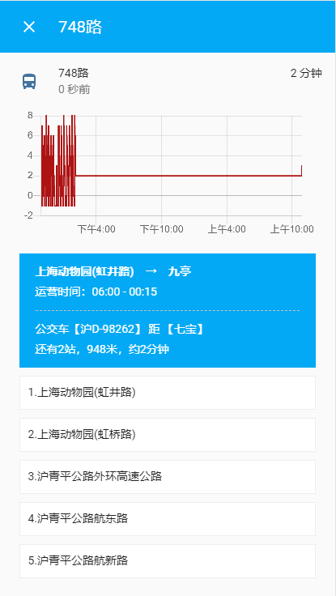
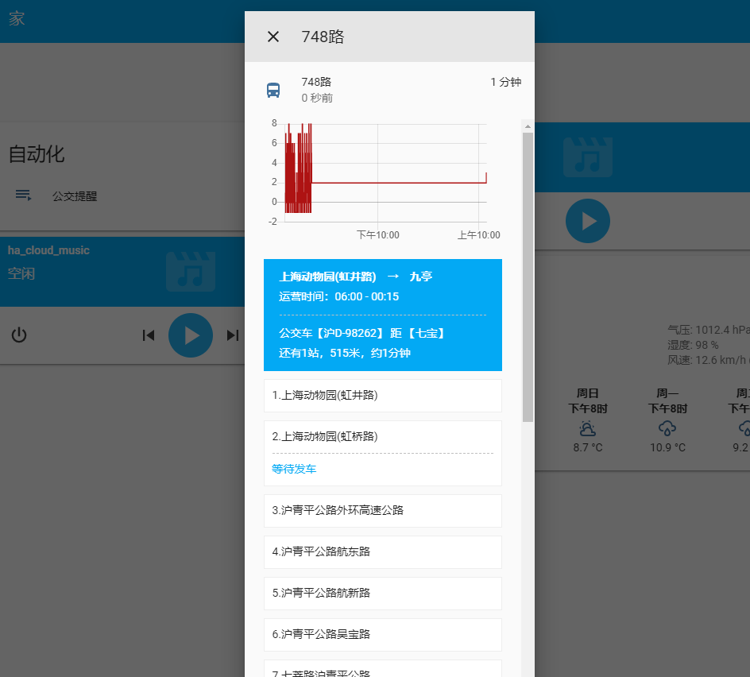

 # 上海公交HA插件

 ## 如何使用

> 安装

 将本项目【shbus文件夹】复制到HA的custom_components文件夹中

> 插件配置

 然后在configuration.yaml中配置以下内容

```

# 上海公交
# name: 公交车（没有会安装失败）
# direction: 方向（默认：1）
# stop_id: 监测第几站

sensor:
  - platform: shbus
    name: 748路
    direction: 1
    stop_id: 10
  - platform: shbus
    name: 748路
    direction: 0
    stop_id: 6

```

## 图片预览



